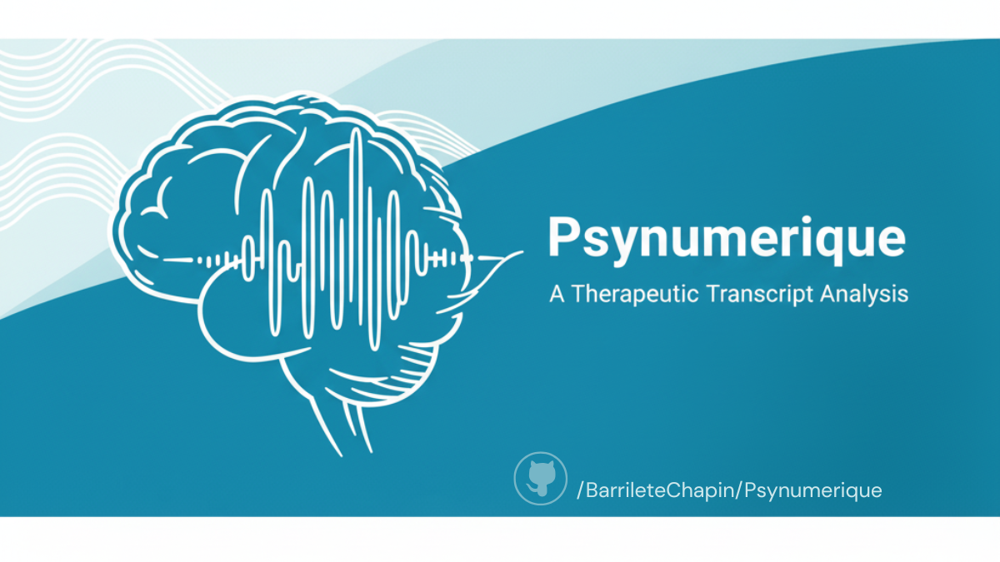

# Psymerique - Therapeutic Transcript Analysis

A comprehensive desktop application for analyzing therapeutic session transcripts using advanced NLP techniques and interactive visualizations.

https://github.com/user-attachments/assets/abd1acb7-e356-48e1-9713-85683e9f8ac3

## Features

### 🏠 Home Section
- **File Upload**: Secure .txt file upload with 20MB limit
- **Text Preview**: Real-time transcript preview and editing
- **Validation**: File format and content validation

### 👥 Speaker Identification  
- **AI-Powered Detection**: Advanced BERT-based speaker identification
- **Manual Override**: Click-to-toggle speaker assignments (Client/Therapist/Unknown)
- **Confidence Scoring**: AI confidence percentages for each prediction
- **Filtering**: Option to remove therapist paragraphs from analysis

### 🔍 Entity Detection & Anonymization
- **Smart Detection**: Stanza NLP + regex fallback for entity recognition
- **Entity Types**: PERSON, DATE, TIME, PHONE, EMAIL, MONEY, PERCENT, ORGANIZATION, LOCATION
- **Manual Addition**: Add entities not detected automatically
- **Selective Anonymization**: Choose which entities to anonymize with custom replacements
- **Real-time Preview**: See anonymization effects before applying

### 💭 Sentiment Analysis
- **Multi-Category Analysis**: Positive, Negative, Neutral, Mixed sentiment detection
- **Confidence Scoring**: AI confidence levels for each sentiment prediction
- **Interactive Editing**: Click sentiment badges to manually adjust
- **Visual Summary**: Real-time statistics with percentage distributions

### 📝 Thematic Encoding
- **Custom Coding Schemes**: Create unlimited coding categories with keywords
- **Automatic Detection**: Keyword-based paragraph coding
- **Manual Coding**: Click-to-add codes to specific paragraphs
- **Bulk Operations**: Apply coding schemes across entire transcript

### 📊 Comprehensive Reports
- **Interactive Visualizations**: 
  - Word frequency analysis with stop-word filtering
  - Word clouds for visual text analysis
  - Sentiment distribution charts
  - Coding overview statistics
- **Export Options**:
  - JSON: Complete analysis data with metadata
  - PNG Charts: High-quality chart images (matplotlib-based, no browser dependency)
  - PDF Reports: Professional reports with embedded charts and analysis

## Technical Stack

- **Frontend**: NiceGUI (Python-based web interface)
- **NLP**: Custom therapeutic BERT model + Stanza + transformers
- **Visualization**: Plotly + matplotlib + wordcloud
- **Export**: fpdf2 for PDF generation
- **AI Models**: Multi-language support (English, Spanish, Portuguese, French)

## Installation

1. **Clone the repository**
```bash
git clone <repository-url>
cd psymerique-app
```
2. **Create virtual environment**
```bash
python -m venv venv
source venv/bin/activate  # On Windows: venv\Scripts\activate
```

3. **Install dependencies**
```bash
pip install -r requirements.txt
```
3.5 **Download the Custom AI Model**
 - The file **model.safetensors** is [here](https://doi.org/10.5281/zenodo.17058629)
 - Please download it and save it under the folder 'src/Model/' 
 
4. **Run the application**
```bash
python main.py
```

The application will start on `http://localhost:8080`

## Dependencies

### Core Requirements
- `nicegui>=1.4.0` - Web interface framework
- `pandas>=2.0.0` - Data manipulation
- `numpy>=1.24.0` - Numerical computing

### NLP & AI
- `stanza>=1.7.0` - Advanced NLP pipeline (for identifying entities)
- `torch>=2.0.0` - PyTorch for deep learning
- `transformers>=4.30.0` - Hugging Face transformers
- `safetensors>=0.3.0` - Safe tensor serialization

### Visualization & Export
- `plotly>=5.17.0` - Interactive charts (UI only)
- `matplotlib>=3.7.0` - Chart export without browser dependency
- `wordcloud>=1.9.0` - Word cloud generation
- `fpdf2>=2.7.0` - PDF report generation

## Project Structure

```
psymerique-app/
├── main.py                 # Application entry point
├── requirements.txt        # Python dependencies
├── README.md              # This file
├── src/
│   ├── config.py          # Application configuration
│   ├── app_state.py       # Central state management
│   ├── services/
│   │   ├── nlp_service.py         # NLP processing
│   │   ├── therapeutic_model.py   # Custom BERT model
│   │   └── export_service.py      # Export functionality
│   ├── utils/
│   │   └── text_processing.py     # Text utilities
│   └── ui/
│       ├── layout.py      # Main navigation
│       ├── theme.py       # Styling and themes
│       └── components/    # UI sections
│           ├── home.py
│           ├── speakers.py
│           ├── entities.py
│           ├── sentiment.py
│           ├── encoding.py
│           └── report.py
└── Model/                 # AI model files
    ├── config.json
    ├── model.safetensors
    └── model_info.json
```

## Usage Workflow

1. **Upload Transcript**: Start by uploading a .txt file containing the therapeutic session
2. **Speaker Identification**: Use AI to identify speakers or manually assign them
3. **Entity Detection**: Detect and optionally anonymize sensitive information
4. **Sentiment Analysis**: Analyze emotional tone throughout the conversation
5. **Thematic Coding**: Apply coding schemes to categorize content themes
6. **Generate Reports**: Export comprehensive analysis as JSON, charts, or PDF

## AI Model

The application includes a custom therapeutic BERT model trained specifically for:
- **Speaker Identification**: Distinguishing between client and therapist speech
- **Sentiment Analysis**: 4-category emotional analysis optimized for therapeutic contexts
- **Multi-language Support**: English, Spanish, Portuguese, and French
- **Confidence Scoring**: Reliability metrics for all predictions

We generated a dataset and model that can be found in:
- [Dataset](https://doi.org/10.5281/zenodo.17055509)
- [Model](https://doi.org/10.5281/zenodo.17058629) fine-tuned on DistilBERT base multilingual (cased) (Sanh et al., 2019) 

## Export Capabilities

### JSON Export
- Analysis metadata
- Word frequency statistics
- Sentiment and coding distributions
- Transcript with annotations
- Configuration backup

### Chart Export (PNG)
- Word frequency bar charts
- Word clouds
- Sentiment distribution pie charts
- Coding overview statistics

### PDF Reports
- Executive summary
- Embedded charts and visualizations
- Updated Transcript
- Comprehensive analysis results

## Privacy & Security

- **Local Processing**: All analysis runs locally, no data sent to external servers
- **Selective Anonymization**: Choose exactly which entities to anonymize
- **Secure File Handling**: Temporary files cleaned up automatically
- **No Data Retention**: Files not permanently stored unless explicitly saved

## License

MIT License

## References

### Libraries Used

Hunter, J. D. (2007). Matplotlib: A 2D graphics environment [Computer software]. https://matplotlib.org

Mueller, A. (2012). WordCloud: A little word cloud generator in Python [Computer software]. https://github.com/amueller/word_cloud

Hugging Face. (2022). SafeTensors: Safe tensor serialization [Computer software]. https://github.com/huggingface/safetensors

Harris, C. R., Millman, K. J., van der Walt, S. J., Gommers, R., Virtanen, P., Cournapeau, D., Wieser, E., Taylor, J., Berg, S., Smith, N. J., Kern, R., Picus, M., Hoyer, S., van Kerkwijk, M. H., Brett, M., Haldane, A., del Río, J. F., Wiebe, M., Peterson, P., ... Oliphant, T. E. (2020). NumPy [Computer software]. https://numpy.org

Paszke, A., Gross, S., Massa, F., Lerer, A., Bradbury, J., Chanan, G., Killeen, T., Lin, Z., Gimelshein, N., Antiga, L., Desmaison, A., Kopf, A., Yang, E., DeVito, Z., Raison, M., Tejani, A., Chilamkurthy, S., Steiner, B., Fang, L., ... Chintala, S. (2019). PyTorch: An imperative style, high-performance deep learning library [Computer software]. https://pytorch.org

Plotly Technologies Inc. (2015). Plotly: Collaborative data science [Computer software]. https://plot.ly

Py-PDF contributors. (2017). FPDF2: Simple PDF generation for Python [Computer software]. https://github.com/py-pdf/fpdf2

Qi, P., Zhang, Y., Zhang, Y., Bolton, J., & Manning, C. D. (2020). Stanza: A Python natural language processing toolkit for many human languages [Computer software]. Stanford NLP Group. https://stanfordnlp.github.io/stanza/

The Pandas Development Team. (2008). pandas: Powerful data structures for data analysis [Computer software]. https://pandas.pydata.org

Wolf, T., Debut, L., Sanh, V., Chaumond, J., Delangue, C., Moi, A., Cistac, P., Rault, T., Louf, R., Funtowicz, M., Davison, J., Shleifer, S., von Platen, P., Ma, C., Jernite, Y., Plu, J., Xu, C., Scao, T. L., Gugger, S., ... Rush, A. M. (2020). Transformers: State-of-the-art natural language processing [Computer software]. Hugging Face. https://huggingface.co/transformers/

Zauberzeug GmbH. (2021). NiceGUI: Web-based user interfaces with Python [Computer software]. https://nicegui.io

---

**Psymerique** - Advanced Therapeutic Transcript Analysis for Research and Clinical Practice
